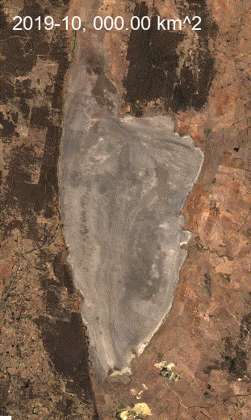

# timelapse_of_water_body_extension

This project allows to identify water bodies from the Surface Reflectance layers
of Sentinel-2 imagery and quantify its surface over a period of interest.

## Prerequisite

It requires an account on Google Earth Engine and an active GEE project.

# Use

You can run this scrit on your local pc.

Edit the first section of the script with your GEE project name and the details
of your area of interest.

Here the analysis of the extent of Lake George (NSW) over 5 years:
>
